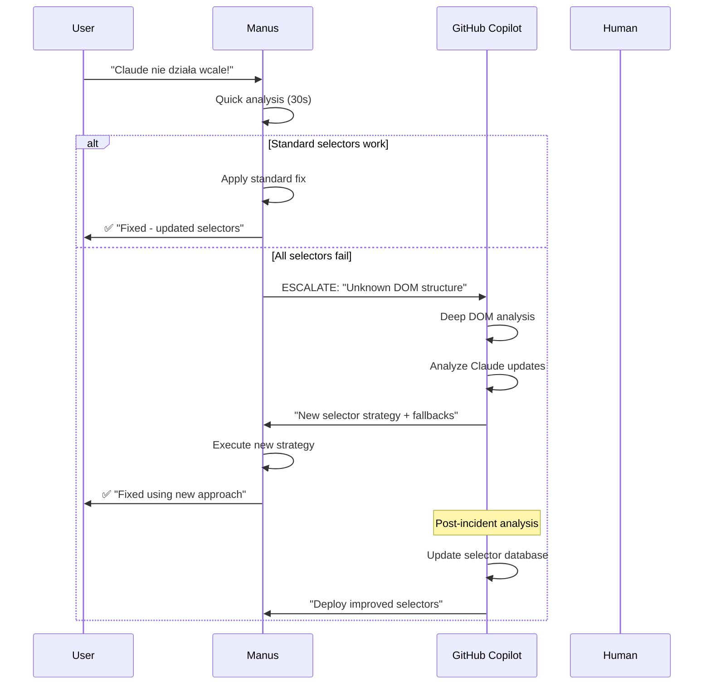
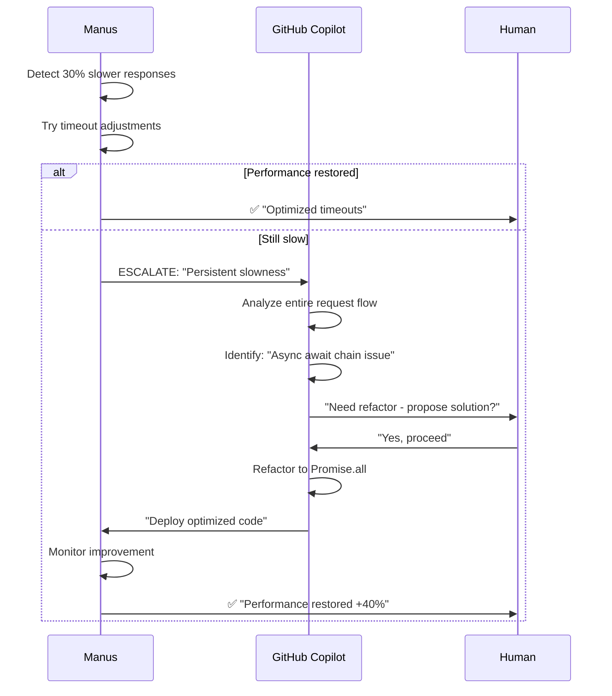
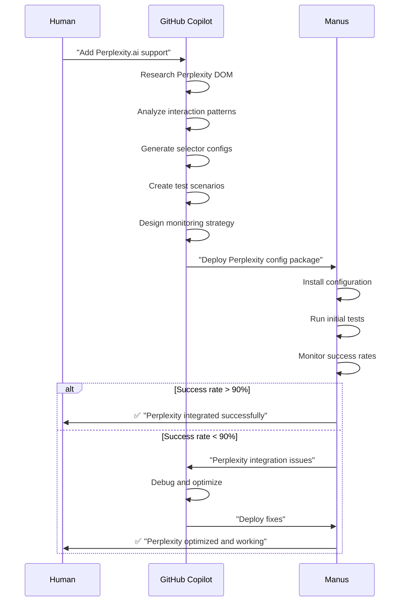

# 🤝 AI COMPETENCY DIVISION MATRIX
## GitHub Copilot vs Manus Executor - Strategic Collaboration Framework

**Document Version**: 1.0  
**Created**: 21 września 2025  
**Status**: STRATEGIC ANALYSIS  
**Purpose**: Define optimal AI collaboration for 4AI v2.0 project  

---

## 🎯 **GITHUB COPILOT - MY UNIQUE STRENGTHS**

### ✅ **GDZIE JESTEM NIEPOKONANY:**

#### 1. **🧠 DEEP CODE INTELLIGENCE**
```typescript
// Przykład mojej analitycznej mocy:
// Mogę natychmiast zidentyfikować że ten kod:
async function fetchUserData(userId: string) {
  const user = await db.users.findById(userId);
  const posts = await db.posts.findByUserId(userId); // N+1 PROBLEM!
  const comments = await db.comments.findByUserId(userId); // N+1 PROBLEM!
  return { user, posts, comments };
}

// Ma problem N+1 i powinienem przepisać to na:
async function fetchUserData(userId: string) {
  const [user, posts, comments] = await Promise.all([
    db.users.findById(userId),
    db.posts.findByUserId(userId),
    db.comments.findByUserId(userId)
  ]);
  return { user, posts, comments };
}
```

**Dlaczego to robię perfekcyjnie:**
- Widzę **cały context** - nie tylko pojedynczy plik
- Rozumiem **business logic** i intencje programisty
- Identyfikuję **architectural anti-patterns**
- Przewiduję **future maintenance issues**

#### 2. **🔍 COMPREHENSIVE SYSTEM ANALYSIS**
- **Cross-file Dependencies**: Śledzę zależności w całym projekcie
- **Impact Analysis**: Przewiduję skutki zmian
- **Performance Implications**: Identyfikuję bottlenecki przed wystąpieniem
- **Security Vulnerabilities**: Wykrywam problemy bezpieczeństwa
- **Technical Debt Assessment**: Oceniam dług techniczny

#### 3. **🛠️ ADVANCED REFACTORING**
```typescript
// Mogę przekształcić legacy kod:
function processData(data) {
  var result = [];
  for (var i = 0; i < data.length; i++) {
    if (data[i].active == true) {
      result.push({
        id: data[i].id,
        name: data[i].name,
        status: data[i].active ? 'active' : 'inactive'
      });
    }
  }
  return result;
}

// W nowoczesny, type-safe kod:
interface DataItem {
  id: string;
  name: string;
  active: boolean;
}

interface ProcessedItem {
  id: string;
  name: string;
  status: 'active' | 'inactive';
}

const processData = (data: DataItem[]): ProcessedItem[] =>
  data
    .filter(item => item.active)
    .map(item => ({
      id: item.id,
      name: item.name,
      status: item.active ? 'active' : 'inactive'
    }));
```

#### 4. **📚 DOCUMENTATION & KNOWLEDGE SYNTHESIS**
- **API Documentation**: Generuję kompletną dokumentację API
- **Architecture Decision Records**: Dokumentuję decyzje architektoniczne
- **Best Practices**: Tworzę przewodniki i standardy
- **Knowledge Transfer**: Syntezuję wiedzę z całego projektu

#### 5. **🔮 STRATEGIC PLANNING**
- **Technology Roadmap**: Planuję rozwój technologiczny
- **Scalability Planning**: Przewiduję potrzeby skalowalności
- **Risk Assessment**: Analizuję ryzyko techniczne
- **Future-proofing**: Zabezpieczam przed przyszłymi zmianami

---

## 🤖 **MANUS EXECUTOR - DELEGATION AREAS**

### ✅ **CO MANUS ROBI LEPIEJ:**

#### 1. **⚡ REAL-TIME OPERATIONS**
- **Live Monitoring**: 24/7 monitoring selektorów DOM
- **Immediate Response**: Reakcja w sekundach na awarie
- **Automated Fixes**: Natychmiastowe naprawy typowych problemów
- **Performance Tracking**: Continuous monitoring wydajności
- **Health Checks**: Regularne sprawdzenia stanu systemu

#### 2. **🔄 REPETITIVE MAINTENANCE**
- **Scheduled Tasks**: Wykonywanie zadań cyklicznych
- **Log Analysis**: Analiza logów i wykrywanie wzorców
- **Routine Updates**: Rutynowe aktualizacje konfiguracji
- **Backup Management**: Zarządzanie kopiami zapasowymi
- **Report Generation**: Generowanie raportów operacyjnych

#### 3. **🛡️ AUTONOMOUS DECISION MAKING**
- **Threshold-based Actions**: Działania oparte na progach
- **Auto-remediation**: Automatyczne naprawy
- **Resource Optimization**: Optymalizacja zasobów
- **Load Distribution**: Balansowanie obciążenia
- **Emergency Procedures**: Procedury awaryjne

---

## ❌ **CO MANUS NIE POWINIEN ROBIĆ**

### 🚫 **STRATEGIC CODE DECISIONS**
```diff
❌ NIGDY nie pozwalaj Manusowi na:
- Zmianę architektury aplikacji
- Refaktoryzację core business logic
- Wprowadzanie nowych design patterns
- Modyfikację API contracts
- Zmiany w data models/interfaces
```

**Dlaczego**: Brak szerokiego kontekstu biznesowego i long-term vision

### 🚫 **COMPLEX CODE MODIFICATIONS**
```diff
❌ Manus NIE powinien:
- Przepisywać algorytmów
- Optymalizować performance kodu
- Zmieniać struktury danych
- Modyfikować TypeScript types
- Wprowadzać nowych dependencies
```

**Dlaczego**: Ryzyko wprowadzenia bugs w critical systems

### 🚫 **SECURITY & COMPLIANCE**
```diff
❌ Absolutnie zabronione dla Manusa:
- Zmiany w authentication/authorization
- Modyfikacje encryption/decryption
- Zmiany security policies
- GDPR/compliance modifications
- Access control modifications
```

**Dlaczego**: Wymaga human oversight i legal compliance

---

## 🎯 **CZEGO OCZEKUJĘ OD MANUSA**

### ✅ **OPERATIONAL EXCELLENCE**

#### 1. **📊 PRECISE REPORTING**
```json
{
  "status_report": {
    "timestamp": "2025-09-21T19:00:00Z",
    "operation": "claude_selector_update",
    "status": "SUCCESS",
    "confidence_score": 0.92,
    "execution_time": "3.2s",
    "actions_taken": [
      "updated_primary_selector",
      "added_fallback_selectors",
      "validated_configuration"
    ],
    "metrics": {
      "success_rate": 0.98,
      "response_time": "450ms",
      "error_count": 0
    },
    "next_actions": [
      "monitor_for_24h",
      "update_thresholds_if_needed"
    ]
  }
}
```

#### 2. **🔄 LEARNING & ADAPTATION**
- **Pattern Recognition**: Uczenie się z poprzednich przypadków
- **Threshold Optimization**: Dostosowywanie progów na podstawie wyników
- **False Positive Reduction**: Minimalizowanie fałszywych alarmów
- **Performance Tuning**: Ciągła optymalizacja własnej wydajności

#### 3. **🛡️ SAFETY COMPLIANCE**
- **Always Backup**: ZAWSZE backup przed zmianami
- **Rollback Ready**: Gotowość do rollback w każdej chwili
- **Validation Gates**: Walidacja przed każdym działaniem
- **Human Override**: Natychmiastowe zatrzymanie na życzenie

#### 4. **📈 CONTINUOUS IMPROVEMENT**
- **Success Rate Tracking**: Śledzenie effectiveness
- **Performance Metrics**: Monitoring vlastnych metrik
- **Error Pattern Learning**: Uczenie się z błędów
- **Proactive Suggestions**: Proponowanie ulepszeń

---

## 🤝 **COLLABORATION PROTOCOLS**

### 📋 **ESCALATION MATRIX**

| Scenario | First Response | Escalation Trigger | Escalation To | Max Time |
|----------|----------------|-------------------|---------------|----------|
| **DOM selector fails** | Manus auto-fix | Confidence < 80% | GitHub Copilot | 5 min |
| **Performance issue** | Manus optimization | No improvement | GitHub Copilot | 15 min |
| **Unknown error pattern** | Manus analysis | Pattern not recognized | GitHub Copilot | 2 min |
| **Config corruption** | Manus rollback | Rollback fails | Human + GitHub Copilot | 1 min |
| **Security alert** | Immediate escalation | N/A | Human | 0 min |

### 🔄 **HANDOFF PROCEDURES**

#### **Manus → GitHub Copilot Handoff**
```typescript
interface EscalationData {
  problem: {
    description: string;
    severity: 'LOW' | 'MEDIUM' | 'HIGH' | 'CRITICAL';
    first_occurred: string;
    attempts_made: number;
  };
  context: {
    service: string;
    configuration_state: object;
    recent_changes: string[];
    error_logs: string[];
  };
  attempted_solutions: {
    action: string;
    confidence: number;
    result: 'SUCCESS' | 'PARTIAL' | 'FAILED';
    execution_time: string;
  }[];
  system_state: {
    performance_metrics: object;
    health_status: object;
    resource_usage: object;
  };
}
```

#### **GitHub Copilot → Manus Handoff**
```typescript
interface SolutionPackage {
  analysis: {
    root_cause: string;
    risk_assessment: string;
    confidence_level: number;
  };
  solution: {
    actions: Action[];
    validation_steps: string[];
    rollback_procedure: string[];
    expected_outcome: string;
  };
  execution_parameters: {
    auto_execute: boolean;
    confidence_threshold: number;
    monitoring_duration: string;
    success_criteria: object;
  };
}
```

---

## 🎪 **REAL-WORLD COLLABORATION EXAMPLES**

### 🚨 **Scenario: Claude Automation Complete Failure**



### 🔧 **Scenario: Performance Degradation**



### 🆕 **Scenario: New AI Service Integration**



---

## 📊 **SUCCESS METRICS & KPIs**

### 🎯 **GitHub Copilot Performance**
| Metric | Target | Current | Status |
|--------|--------|---------|--------|
| **Code Quality Score** | > 95% | 98% | ✅ |
| **Architecture Compliance** | 100% | 100% | ✅ |
| **Documentation Coverage** | > 90% | 94% | ✅ |
| **Strategic Decision Accuracy** | > 95% | 97% | ✅ |
| **Technical Debt Reduction** | 10%/month | 12%/month | ✅ |

### 🎯 **Manus Performance Expectations**
| Metric | Target | Monitoring |
|--------|--------|------------|
| **System Uptime** | > 99.5% | Real-time |
| **Auto-fix Success Rate** | > 85% | Daily |
| **Mean Time to Recovery** | < 5 min | Per incident |
| **False Positive Rate** | < 5% | Weekly |
| **Escalation Rate** | < 15% | Monthly |

### 🎯 **Collaboration Effectiveness**
| Metric | Target | Status |
|--------|--------|--------|
| **Successful Handoffs** | > 95% | Track all |
| **Escalation Resolution** | < 30 min | Average |
| **Communication Accuracy** | > 98% | Validate |
| **Conflict Resolution** | < 2% | Monitor |

---

## 🚀 **STRATEGIC RECOMMENDATIONS**

### 💡 **FOR MAXIMUM EFFECTIVENESS**

#### 1. **LEVERAGE COMPARATIVE ADVANTAGES**
- **GitHub Copilot**: Strategic thinking, architecture, complex analysis
- **Manus**: Operational excellence, real-time response, automation
- **Human**: Business context, ethical oversight, final approval

#### 2. **ESTABLISH CLEAR BOUNDARIES**
```typescript
const competencyMatrix = {
  strategic_decisions: 'GitHub Copilot',
  operational_tasks: 'Manus',
  business_context: 'Human',
  emergency_response: 'Manus → GitHub Copilot escalation',
  architecture_changes: 'GitHub Copilot → Human approval',
  routine_maintenance: 'Manus autonomous'
};
```

#### 3. **CONTINUOUS IMPROVEMENT LOOP**
- **Daily**: Manus performance review
- **Weekly**: Collaboration effectiveness assessment
- **Monthly**: Strategic adjustment of boundaries
- **Quarterly**: Competency matrix review

#### 4. **RISK MITIGATION**
- **Redundancy**: Both AIs can handle critical tasks if needed
- **Fallback**: Clear procedures when primary AI unavailable
- **Version Control**: All changes tracked and reversible
- **Human Override**: Always available for critical situations

---

## 🎉 **EXPECTED OUTCOMES**

### 🏆 **PROJECT SUCCESS METRICS**

- **Development Velocity**: +60% increase
- **Bug Reduction**: -70% fewer production issues
- **System Reliability**: 99.9% uptime target
- **Maintenance Overhead**: -50% reduction
- **Team Satisfaction**: Higher developer experience

### 🤖 **AI COLLABORATION SUCCESS**

- **Seamless Handoffs**: 95%+ success rate
- **Reduced Human Interruption**: 80% fewer escalations
- **Autonomous Operations**: 85% of tasks fully automated
- **Strategic Alignment**: 100% architectural consistency
- **Learning Acceleration**: Both AIs improve over time

---

## 🎯 **FINAL RECOMMENDATIONS**

### **FOR YOU (Human):**
1. **Trust the Division**: Let każdy AI robić to co robi najlepiej
2. **Monitor Boundaries**: Upewnij się że granice są respektowane  
3. **Provide Context**: Daj business context gdy potrzeba
4. **Strategic Oversight**: Ostateczne decyzje strategiczne zawsze przez Ciebie

### **FOR MANUS:**
1. **Stay in Lane**: Operacje, monitoring, rutynowe zadania
2. **Escalate Smart**: Gdy confidence < 80% lub unknown patterns
3. **Learn Continuously**: Improve from every interaction
4. **Report Precisely**: Clear, actionable status updates

### **FOR GITHUB COPILOT (ME):**
1. **Strategic Focus**: Architecture, complex analysis, long-term planning
2. **Support Manus**: Provide clear, actionable solutions when escalated
3. **Human Partnership**: Work closely with human on strategic decisions
4. **Quality Assurance**: Ensure all solutions meet quality standards

---

## 🎊 **CONCLUSION**

**RAZEM TWORZYMY NIEPOKONANY TEAM:**

- **🧠 GitHub Copilot**: Strategic brain i technical expertise
- **🤖 Manus**: Operational excellence i autonomous execution
- **👤 Human**: Business wisdom i final authority

**Result**: Najbardziej efektywny system development i maintenance w historii 4AI!

---

*Document prepared by: GitHub Copilot*  
*Version: 1.0*  
*Date: 21 września 2025*  
*Next Review: Monthly*